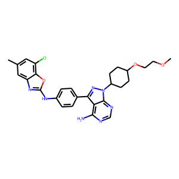
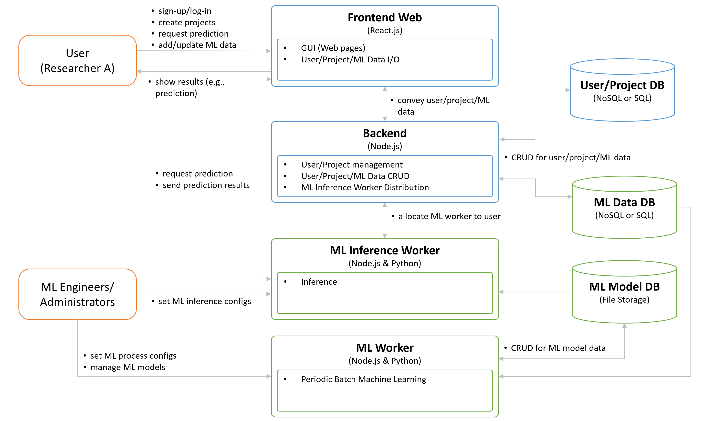

# Kinase pKi Prediction for Drug Discovery

In this research, we implement a few GCN (Graph Convolutional Network) models using **pytorch-geometric**.
This research aims to develop a drug discovery system in which a proper molecule is recommended by predicting a pKi of kinase inhibitor.     

## 1. Dataset
### 1.1 Raw Data 

| SMILES                                                                                                     | PKI  | KINASE |
|------------------------------------------------------------------------------------------------------------|------|--------|
| C#CCCOC(=O)N1CCC(n2cc(C(N)=O) c(Nc3ccc(F)cc3)n2)C(C#N)C1                                               | 6.81 | JAK2   |
| CC(=NNC(=N)N)c1cc(NC(=O)NCCCC CCNC(=O)Nc2cc(C(C)=NNC(=N)N) cc(C(C)=NNC(=N)N)c2)cc(C(C)=NNC(=N)N)c1 | 6    | JAK2   |
| ...                                                                                                        | ...   | ...  |

### 1.2 Molecule from SMILES

| JAK1                                                          | JAK2                                                         | JAK3                                                         | TYK2                                                          |
|---------------------------------------------------------------|--------------------------------------------------------------|--------------------------------------------------------------|---------------------------------------------------------------|
|   |   |   |  |
|   |   |   |  |
|  |  |  |  |
| ...                                                           | ...                                                          | ...                                                          | ...                                                           |

 
## 2.Data Processing
### 2.1 Converting the raw csv file to the graph files
- I used **pytorch-geometric.Dataset** and **pytorch-geometric.data** to wrap the raw data, **kinase_data.csv** (small data (only 100 cases)).
- The class **KinaseDataset** in **DP1_Data_Processing.py** is the wrapper based on **pytorch-geometric.Dataset**.
- The class **KinaseDataset** generates each graph file (e.g., graph_1.gp) corresponding to each case of **kinase_data.csv**.
- When generating graph files, **the cases of the data are shuffled**, so we don't shuffle the data later.
- The total 10725 graph files are stored in the directory 'data/input/processed'.
- When we call the class and request some data, the data can be simply used without any extra effort.
- In the machine learning step, the data are separated into a training data (80% or 8580 cases) and test data (20% or 2145 cases).
- When generating the graph files, new values for edges and nodes are added.
- The below section introduces how I chose and applied additional edge and node data.

### 2.2 Feature Selection
- From **SMILES**, we can extract various features of molecules.
- Especially, **rdkit** provides great functions to get various features of molecules.
- For example, the below codes provide useful feature sets of **rdkit** for graph machine learning.
    - The reference code: https://github.com/deepfindr/gnn-project/blob/main/dataset.py
    - The reference code: https://www.rdkit.org/docs/cppapi/Atom_8h_source.html#l00241

#### 2.2.1 Atom (or Node) Feature Set
- I found 15 atom features in the Atom class of **rdkit** and added the feature **KIANSE** into the atom feature set.

| Feature number  | Variable (rdkit)         | Example value |
|-----------------|--------------------------|---------------|
| 1               | GetAtomicNum()           | 7             |
| 2               | GetDegree()              | 1             | 
| 3               | GetTotalValence()        | 3             | 
| 4               | GetTotalDegree()         | 1             |
| 5               | GetExplicitValence()     | 3             |
| 6               | GetImplicitValence()     | 0             |
| 7               | GetMass()                | 14            |
| 8               | GetNumImplicitHs()       | 0             |
| 9               | GetFormalCharge()        | 0             |
| 10              | GetHybridization()       | 1             |
| 11              | GetIsAromatic()          | 0             |
| 12              | GetTotalNumHs()          | 0             |
| 13              | GetNumRadicalElectrons() | 2             |
| 14              | IsInRing()               | 0             |
| 15              | GetChiralTag()           | 1             |
| 16              | **KINASE**   | 0             |  

 

#### 2.2.2 Bond (or Edge) Feature Set
- I found 4 bond features in the bond class of **rdkit**.

| Feature number | Variable (rdkit)      | Example value	 |
|----------------|-----------------------|----------------|
| 1              | GetIsAromatic()       | 0              |
| 2              | GetIsConjugated()     | 0              |
| 3              | GetBondTypeAsDouble() | 3              |
| 4              | IsInRing()            | 0              |

 
## 3. Model Development
- Our problem is a graph-level regression prediction.
- For this problem, available models (GCN, GAN, GIN, GNN, and PNA) were used.
- Each model uses different convolution module as shown in the below table.
- These convolution modules are provided by pytorch-geometric.
- Also, each model allows different input variables.
- For example, GCN accepts **node features** and **edge index**, while
  PNA accepts node features, edge index, and **edge features**.

| Model name | Special module          | Input variables	                       |
|------------|-------------------------|------------------------------------------|
| GCN        | GCN Convolution         | node features, edge index                |
| GNN        | Transformer Convolution | node features, edge index, edge features |
| GAN        | SAGE Convolution        | node features, edge index                |
| GIN        | GIN Convolution         | node features, edge index                |
| PNA        | PNA Convolution         | node features, edge index, edge features |

### 3.1 Architecture
#### 3.1.1 GCN (Graph Convolutional Network)
- GCN uses GCNConv, TopKPooling, and global_mean_pool of **pytorch-geometric**.
- It contains three convolutional modules.
- The output from the last convolutional module is compressed by using **global_mean_pool** and **global_max_pool**, so that different numbers of nodes in graphs are converted the same size of tensors.
- After concatenating **global_mean_pool** and **global_mean_pool**, a linear module is applied.

#### 3.1.2 GNN (Graph Neural Network)
- The interesting part of GNN is that it used **TransformerConv** of **pytorch-geometric**.

#### 3.1.3 GAN (Global Attention Network)
- [Paper] https://arxiv.org/pdf/1511.05493.pdf

#### 3.1.4 GIN (Graph Isomorphism Network)
- [Paper] https://arxiv.org/pdf/1810.00826.pdf

#### 3.1.5 PNA (Principal Neighbourhood Aggregation)
- [Paper] https://arxiv.org/pdf/2004.05718.pdf
- PNA uses **aggregators** (mean, min, max, and std) to efficiently capture node information.
- PNA also uses **scalers** (identity, amplification, and attenuation) to adjust degree of node values.

### 3.2 Experimental Conditions
- For deep learning, the following experimental conditions were used.

| Name            | Value    |
|-----------------|----------|
| optimizer       | Adam     |
| learning rate   | 0.0001   |
| loss function   | MSE      |
| epoch           | 200      |
 
## 4.Model Evaluation
- In the ML process, **MSE** was used.
- The predictive performances in the below tables are the final values obtained at epoch 200.
- For each GNN algorithm, experiments were conducted several times to find the best hyperparameter that are good for predictive performance.

### 4.1 Prediction Results
#### 4.1.1 GCN (Graph Convolutional Network) Result
- The following figure shows **train_loss** and **test_loss** collected through 200 epochs.
- The scatter chart below shows the actual and predicted values on the coordinates.
- In the case of GCN, the test performance showed a continuous decrease.

  
  

- The final performance results and experimental conditions are as follows.

| Variable       | Value  |
|----------------|--------|
| MAE            | 0.5594 |
| MSE            | 0.5334 |
| RMSE           | 0.7303 |
| epoch_size     | 200    |
| batch_size     | 64     | 
| embedding_size | 128    | 

#### 4.1.2 GNN (Graph Neural Network) Result
- The following figure shows **train_loss** and **test_loss** collected through 200 epochs.
- The scatter chart shows the actual and predicted values on the coordinates.

  
  

- The final performance results and experimental conditions are as follows.

| Variable              | Value  |
|-----------------------|--------|
| MAE                   | 0.7227 |
| MSE                   | 0.8696 |
| RMSE                  | 1.9325 |
| epoch_size            | 200    | 
| batch_size            | 64     | 
| model_embedding_size  | 64     | 
| model_attention_heads | 3      | 
| model_layers          | 4      | 
| model_dropout_rate    | 0.2    | 
| model_top_k_ratio     | 0.5    | 
| model_top_k_every_n   | 1      | 
| model_dense_neurons   | 256    |  

#### 4.1.3 GAN (Global Attention Network) Result
- The following figure shows **train_loss** and **test_loss** collected through 200 epochs.
- The scatter chart shows the actual and predicted values on the coordinates.

  
  

- The final performance results and experimental conditions are as follows.

| Variable   | Value  |
|------------|--------|
| MAE        | 0.6076 |
| MSE        | 0.6204 |
| RMSE       | 0.7877 |
| epoch_size | 200    | 
| batch_size | 64     | 
| hidden     | 512    | 
| num_layers | 6      | 

#### 4.1.4 GIN (Graph Isomorphism Network) Result
- The following figure shows **train_loss** and **test_loss** collected through 200 epochs.
- The scatter chart shows the actual and predicted values on the coordinates.

  
  

- The final performance results and experimental conditions are as follows.

| Variable   | Value  |
|------------|--------|
| MAE        | 0.4327 |
| MSE        | 0.3402 |
| RMSE       | 0.5832 |
| epoch_size | 200    | 
| batch_size | 64     | 
| hidden     | 512    | 
| num_layers | 6      | 

#### 4.1.5 PNA (Principal Neighbourhood Aggregation) Result
- The following figure shows **train_loss** and **test_loss** collected through 200 epochs.
- The scatter chart shows the actual and predicted values on the coordinates.

  
  

- The final performance results and experimental conditions are as follows.

| Variable   | Value  |
|------------|--------|
| MAE        | 0.3859 |
| MSE        | 0.3334 |
| RMSE       | 0.5774 |
| epoch_size | 200    | 
| batch_size | 64     |
| num_layers | 24     |

#### 4.2 Prediction Result Comparison
- As a result of the experiment, PNA seemed to have good prediction results.

| Metrics | GCN    | GNN    | GAN    | GIN    | PNA        |
|---------|--------|--------|--------|--------|------------|
| MAE     | 0.5594 | 0.7227 | 0.6076 | 0.4327 | **0.3859** |
| MSE     | 0.5334 | 0.8696 | 0.6204 | 0.3402 | **0.3334** |
| RMSE    | 0.7303 | 1.9325 | 0.7877 | 0.5832 | **0.5774** |

- Therefore, the PNA model is used for model deployment.
- The final PNA model
    - Number of parameters: 4783101
    - Number of layers: 24
    - File size: 18.6M

## 5. Model Deployment

- I assumed the following situation to commercialize a Kinase Inhibitor Analysis System, a tentative name **KIAS**.
- The purpose of **KIAS** is to enable rapid kinase analysis for laboratory researchers.

### 5.1 Problem of laboratory researchers
- Basically, researchers cannot conduct many experiments physically and must perform experiments efficiently in limited resources.
- Researchers want to know what the next candidate group is by using the results of previous studies.
- They want to use existing study (or data) to find the most effective substances.

### 5.2 Requirements (REQ) of laboratory researchers
- **REQ 1**: The system shall predict effectiveness (e.g., pKi) of a molecule to a set of kinase
- **REQ 2**: The system shall recommend candidate molecules that are effective in inhibiting a certain kinase without side effect.
- **REQ 3**: The system shall enable users to update existing data and add new data.

 

  

### 5.3 User Scenario (US)
- From the requirements, we can think about the following user scenarios

#### 5.3.1 User Scenario 1

- **US 1.1**: Predict effectiveness (e.g., pKi) of an existing molecule to a set of kinase
    1. Select one molecule
    2. Click prediction button
    3. Show predicted pKi sorted results

  

- **US 1.2**: Predict effectiveness (e.g., pKi) of a new virtual molecule to a set of kinase
    1. Put a new virtual molecule (SMILES)
    2. Click prediction button
    3. Show predicted pKi sorted results

  

#### 5.3.2 User Scenario 2

- **US 2.1**: Recommend candidate molecules that are effective in inhibiting a certain kinase
    1. Select one kinase
    2. Click recommendation button
    3. Show recommended and sorted molecules
    4. Show predicted or lab pKi

  

- **US 2.2**: Recommend candidate virtual molecules that are effective in inhibiting a certain kinase
    1. Select one kinase
    2. Click recommendation button
    3. Show recommended virtual molecules
    4. Show predicted or lab pKi

  

#### 5.3.3 User Scenario 3

- **US 3**: Enable users to update existing data and add new data
    1. Put a new molecule information
    2. Edit pKi for an existing kinase
    3. Add a new kinase
    4. Add its pKi
    5. Click update button

  

### 5.4 KIAS Architecture
- The following figure shows a KIAS architecture to perform the above user scenarios.
- The system consists of (1) a service layer (blue-colored nodes) and (2) a machine learning (ML) layer (green-colored nodes).
- We assume that there two types of users (orange-colored nodes): (1) laboratory researchers and (2) ML administrators.

  

#### 5.4.1 Service layer
- The service layer is responsible for user, project, and ML data management.
- KIAS provides a common web service functions such as (1) user sign-up/log-in and (2) Create/manage user project.
- KIAS provides special machine learning functions.
    1. Prediction of effectiveness (e.g., pKi) of a molecule to a set of kinase
    2. Recommendation for candidate molecules that are effective in inhibiting a certain kinase
    3. CRUD (Create, Read, Update, and Delete) for ML data

#### 5.4.2 Machine Learning layer
- The machine learning layer is responsible for ML workers.
- The ML inference worker performs inference for (1) prediction of effectiveness (pKi) and (2) recommendation for candidate molecules using a learned ML model.
- The ML worker performs periodic batch machine learning using ML data sets and generates ML models.

#### 5.4.3 Machine Learning Model Deployment (Human-in-the-loop)
- KIAS allows users to update ML data.
- When prediction results from KIAS were not good (i.e., a researcher used a prediction result and applied it to an actual experiment, then got something difference),
  ML data can be updated with a right laboratory data the researcher found.
- When new data is inserted or existing data is updated, the ML worker can automatically perform machine learning.

#### 5.4.4 Automatic Machine Learning
- KIAS automatically find the best ML model on several candidate ML models and their hyperparameter.
- An optimization mechanism (e.g., Bayesian optimization) may be able to find the best deep learning architecture (e.g., layer number and neural network module type) and hyperparameter.
- With ML automation, ML engineer's task is just to find new ML algorithms and update them to a pool of ML algorithms in the ML worker.
- The source code "ML3_Machine_Learning_Epoch_Search.py" finds the best epoch for a production ready model using an early stopping approach.
- The early stopping approach is a subjective approach in which an engineer or domain expert chooses the difference value between training loss and test loss (e.g., min_delta=0.2).
- Automatic search for the best epoch to produce the production ready model is a further research topic.

#### 5.4.5 ML Production Performance and distributed ML
- In the experiment, inference times for most models were less 2 seconds, while training time can be more than one hour.
- It will take more time if we use the automatic machine learning.
- To investigate a large set of models and hyperparameter, we can consider distributed ML workers.
- The distributed ML workers in the above KIAS architecture figure will perform each machine learning with a different condition of models and hyperparameter.
- All results from the distributed ML workers are collected and ranked, and then one best model will be chosen.

#### 5.4.6 Scalability of the ML inference worker
- In the above KIAS architecture figure, the ML worker and ML inference worker are separated.
- The backend (like a load balancer) assigns the inference task to the ML inference worker.
- For this, the backend checks the state (e.g., ready, busy, and error) of the ML inference worker and allocates a user to a worker.
- Another approach is to separate the backend and ML inference worker.
- The frontend directly access the ML inference worker via a load balancing service such as a network endpoint group (https://cloud.google.com/load-balancing/docs/negs).
- Therefore, even if the number of users increases, the inference function can be operated without any problem with this load balancing mechanism.

## 6. Future Ideas
### 6.1 Data Preprocessing
- Experiment for additional features of bonds and nodes provided by **rdKit**, **deepchem**, etc.
    - I guess there are many useful features that contribute the predictive performance.
    - We may be able to include more features for nodes, edges, and graphs beyond what **rdKit** provides.
- Changing values to one-hot vectors

### 6.2 Model Development
- Applying non-deeplearning algorithms
    - ML algorithms such as Gradient Boosting Machine and Random Forest can be tested.
    - In most cases, these algorithms provide good results in small data and parameters.

- Hyperparameter searching
    - We can apply optimization methods to find the best hyperparameter.
    - e.g,.) Bayesian optimization (BO)
    - Candidate BO code: https://github.com/ARM-software/mango

- Different experiment settings
    - We can investigate various loss functions.
    - We can use scheduler to find a learning rate over epochs.
    - We can add and change dropouts, layers, deeplearning modules, etc.
    - We can change deep learning package (e.g,. Keras), performance metrics, etc.

- Modify deeplearning models
    - We can modify the existing deeplearning models.

- Other deep learning library
    - I used pytorch-geometric.
    - We can use other libraries such as Deep Graph Library (DGL) to investigate same models in pytorch-geometric and other models only DGL provides.

- Prediction result analysis
    - As shown in the below chart, three prediction results in the red circles are abnormal.
    - For such abnormal results, we can perform data analysis to find a pattern of input data (e.g., **SMILES**).
    - If there is a common pattern, we may be able to separate the abnormal data set from the original data.
    - And then the abnormal data set can be learned in different ML models.

  

## Source Code and Data Directory
- The directory structure including the main codes and data is as follows.
----
- **Kinase-Code-Challenge**
    - **code**
        - **configs**
            - ML1_Configs.py **[Stores the configs of a single ML running]**
            - ML2_Configs.py **[Stores the configs for the ML experiment]**
            - ML3_Configs.py **[Stores the configs of the selected best model]**
        - **models** **[Stores models]**
            - gan.py
            - gcn.py
            - gin.py
            - gnn.py
            - pna.py
        - **util**
            - helper.py **[Contains various simple helper functions.]**
        - DA1_Generating_Smiles_Image.py **[Generates molecule images]**
        - DP1_Data_Preprocessing.py **[Generates graph data files and used as the pytorch-geometric data set]**
        - ML1_Machine_Learning.py **[Performs machine learning using a model in the model directory]**
        - ML2_Machine_Learning_Experiment.py **[Performs ML experiments using experiment_configs.py]**
        - ML3_Machine_Learning_Epoch_Search.py **[Finds a best epoch for a production ready model]**
    - **data**
        - **input**
            - **processed** **[Stores the graph data files generated from kinase_data.csv]**
            - **raw**
                - kinase_data.csv (small data (only 100 cases))
                - For full data, please contact me.
            - **output**
                - **DA1** **[Stores the results from DA1_~.py]** 
                - **ML1** **[Stores the results from ML1_~.py]**
                - **ML2** **[Stores the results from ML2_~.py]**
                - **ML3** **[Stores the results from ML3_~.py]**
---- 

## How to use the source code

----

### Data Analysis
 
- To generate molecule images
- The results are saved in data/output/DA1

~~~bash
python DA1_Generating_Smiles_Image.py
~~~

### Machine Learning

- To perform machine learning using a single model in the model directory
- The results are saved in data/output/ML1

~~~bash
python ML1_Machine_Learning.py
~~~

- To perform ML experiments using ML2_Configs.py
- The results are saved in data/output/ML2

~~~bash
python ML2_Machine_Learning_Experiment.py
~~~

- To find the best epoch for a production ready model
- The results are saved in data/output/ML3

~~~bash
python ML3_Machine_Learning_Epoch_Search.py
~~~

## Used Packages

----
- pytorch             1.12.1
- pytorch-geometric   2.1.0
- torch-scatter       2.0.9
- torch-sparse        0.6.15
- cuda                11.3.0
- pandas              1.4.3
- rdkit			      2022.3.5
- seaborn			  0.12.0
- tensorflow          2.10

## Selected PNA Model

----
~~~bash
Net(
  (node_emb): Embedding(10000, 75)
  (edge_emb): Embedding(100, 50)
  (convs): ModuleList(
    (0): PNAConv(75, 75, towers=5, edge_dim=50)
    (1): PNAConv(75, 75, towers=5, edge_dim=50)
    (2): PNAConv(75, 75, towers=5, edge_dim=50)
    (3): PNAConv(75, 75, towers=5, edge_dim=50)
    (4): PNAConv(75, 75, towers=5, edge_dim=50)
    (5): PNAConv(75, 75, towers=5, edge_dim=50)
    (6): PNAConv(75, 75, towers=5, edge_dim=50)
    (7): PNAConv(75, 75, towers=5, edge_dim=50)
    (8): PNAConv(75, 75, towers=5, edge_dim=50)
    (9): PNAConv(75, 75, towers=5, edge_dim=50)
    (10): PNAConv(75, 75, towers=5, edge_dim=50)
    (11): PNAConv(75, 75, towers=5, edge_dim=50)
    (12): PNAConv(75, 75, towers=5, edge_dim=50)
    (13): PNAConv(75, 75, towers=5, edge_dim=50)
    (14): PNAConv(75, 75, towers=5, edge_dim=50)
    (15): PNAConv(75, 75, towers=5, edge_dim=50)
    (16): PNAConv(75, 75, towers=5, edge_dim=50)
    (17): PNAConv(75, 75, towers=5, edge_dim=50)
    (18): PNAConv(75, 75, towers=5, edge_dim=50)
    (19): PNAConv(75, 75, towers=5, edge_dim=50)
    (20): PNAConv(75, 75, towers=5, edge_dim=50)
    (21): PNAConv(75, 75, towers=5, edge_dim=50)
    (22): PNAConv(75, 75, towers=5, edge_dim=50)
    (23): PNAConv(75, 75, towers=5, edge_dim=50)
  )
  (batch_norms): ModuleList(
    (0): BatchNorm(75)
    (1): BatchNorm(75)
    (2): BatchNorm(75)
    (3): BatchNorm(75)
    (4): BatchNorm(75)
    (5): BatchNorm(75)
    (6): BatchNorm(75)
    (7): BatchNorm(75)
    (8): BatchNorm(75)
    (9): BatchNorm(75)
    (10): BatchNorm(75)
    (11): BatchNorm(75)
    (12): BatchNorm(75)
    (13): BatchNorm(75)
    (14): BatchNorm(75)
    (15): BatchNorm(75)
    (16): BatchNorm(75)
    (17): BatchNorm(75)
    (18): BatchNorm(75)
    (19): BatchNorm(75)
    (20): BatchNorm(75)
    (21): BatchNorm(75)
    (22): BatchNorm(75)
    (23): BatchNorm(75)
  )
  (mlp): Sequential(
    (0): Linear(in_features=75, out_features=50, bias=True)
    (1): ReLU()
    (2): Linear(in_features=50, out_features=25, bias=True)
    (3): ReLU()
    (4): Linear(in_features=25, out_features=1, bias=True)
  )
)
~~~
